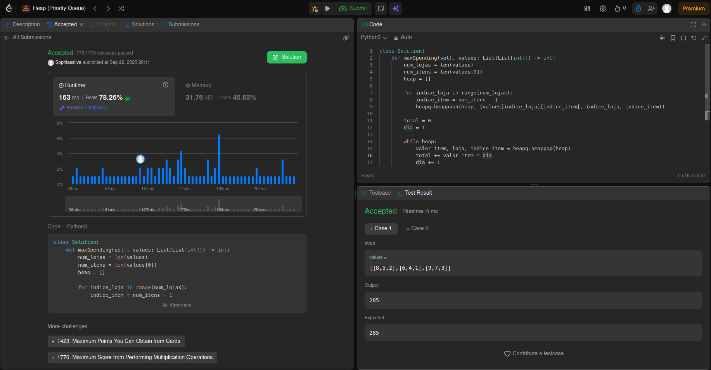
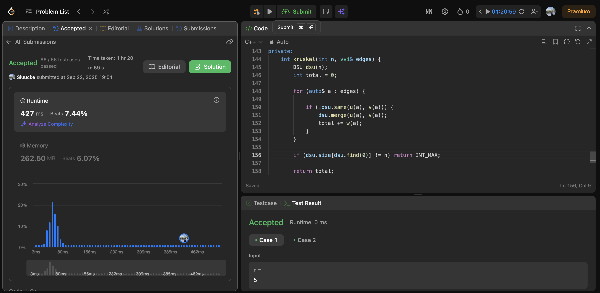
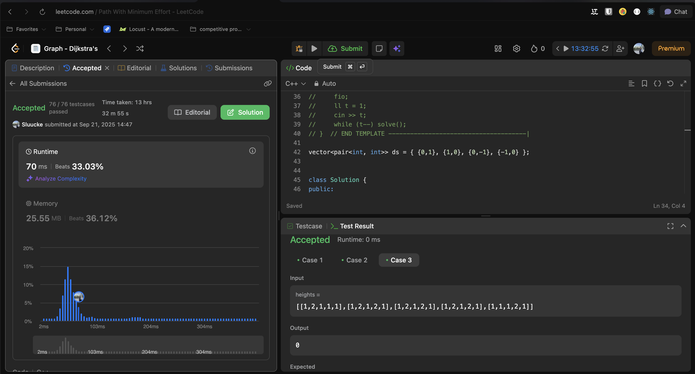
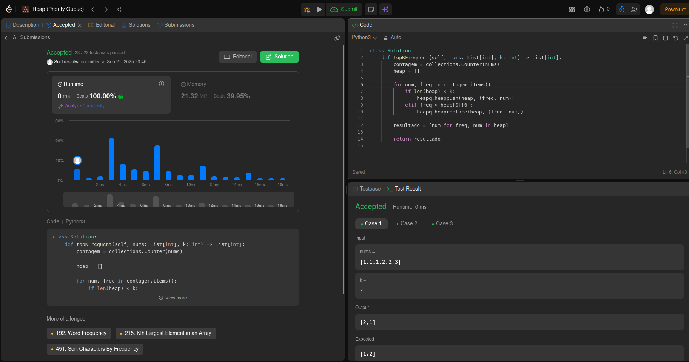

# Trabalho 1 - Grafos 2

**Número do trabalho:** 2  
**Conteúdo: Grafos 2**

## Discentes

| Matrícula |        Nome Completo         |
|:---------:|:----------------------------:|
| 232001649 | David William Lemos Ferreira |
| 231026886 | Sophia Souza da Silva        |

## Definição do Trabalho

Para este segundo trabalho, decidimos resolver questões do leetcode.

## Linguagens utilizadas

Utilizamos as linguagens C++ e Python para resolução das questões.

## Questões

| Questão | Nível  |
|---------|--------|
| [2931. Maximum Spending After Buying Items](https://leetcode.com/problems/maximum-spending-after-buying-items) | Difícil |
| [1489. Find Critical and Pseudo-Critical Edges in Minimum Spanning Tree](https://leetcode.com/problems/find-critical-and-pseudo-critical-edges-in-minimum-spanning-tree) | Difícil |
| [1631. Path With Minimum Effort](https://leetcode.com/problems/path-with-minimum-effort) | Médio |
| [347. Top K Frequent Elements](https://leetcode.com/problems/top-k-frequent-elements) | Médio |

## Screenshots

### Exercício 01 - Maximum Spending After Buying Items

### Exercício 02 - Find Critical and Pseudo-Critical Edges in Minimum Spanning Tree

### Exercício 03 - Path With Minimum Effort

### Exercício 04 - Top K Frequent Elements

## Vídeo de apresentação do Trabalho 1

[Vídeo](https://vimeo.com/1121031914)
